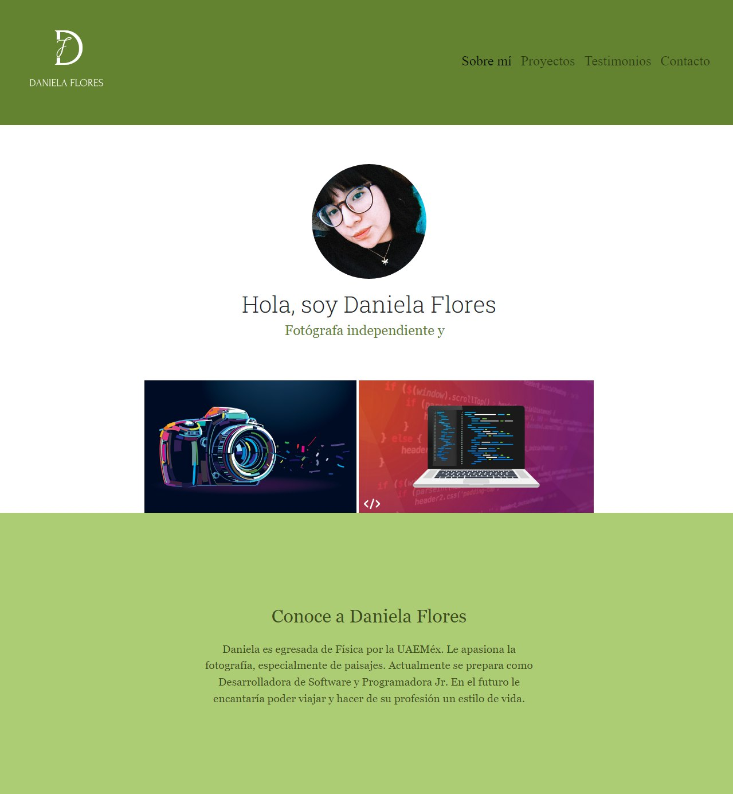
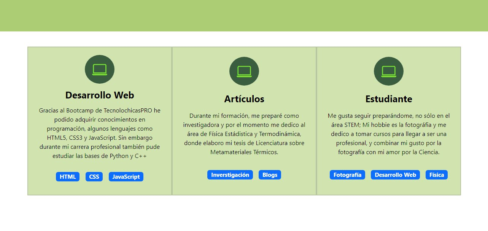
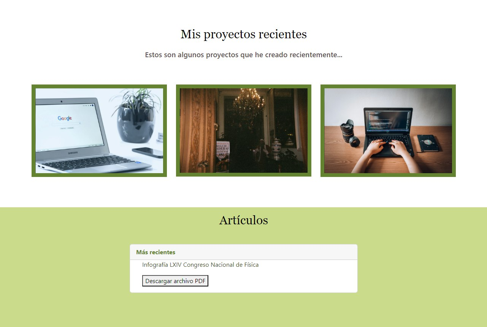
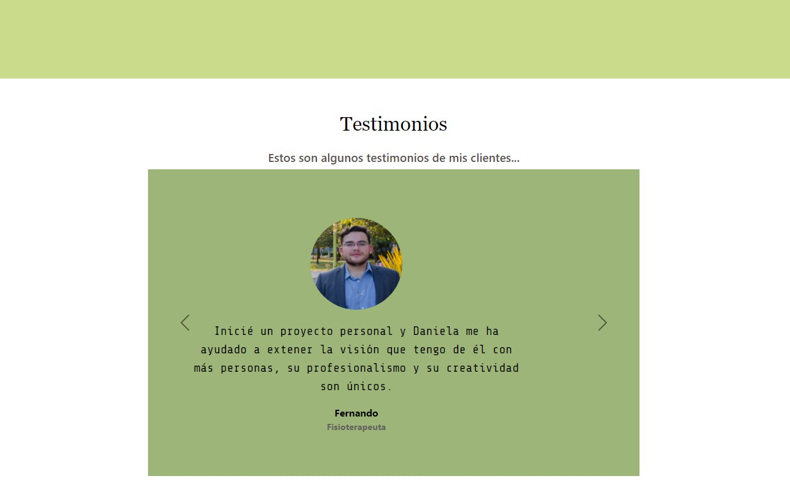
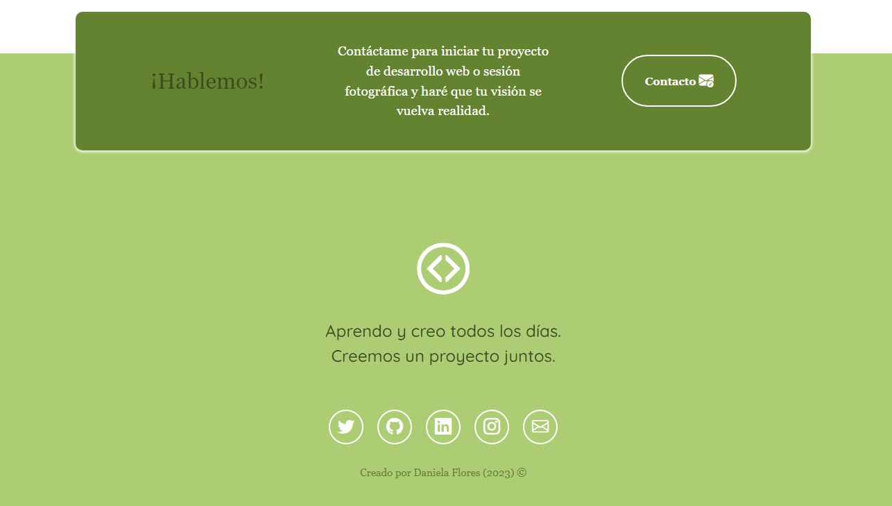

# Portafolio Personal con Bootstrap 5 👩🏽‍💻
#### Creado por Daniela Flores 
En este proyecto final, quise plasmar un poco de mi personalidad. Fue un reto significativo el juntar todos los conocimientos adquiridos mediante el Bootcamp de TecnolochicasPRO, pero al final la satisfacción fue más grande, pues me di cuenta que soy capaz de aprender cosas nuevas a mi propio ritmo. 

## ÍNDICE 
* [Hero](https://github.com/SkyDan231/Final-Project-TecnolochicasPro#%EF%B8%8F-hero)
* [Experiencia](https://github.com/SkyDan231/Final-Project-TecnolochicasPro#-experiencia)
* [Proyectos](https://github.com/SkyDan231/Final-Project-TecnolochicasPro#-proyectos)
* [Testimonios](https://github.com/SkyDan231/Final-Project-TecnolochicasPro#-testimonios)
* [Contacto](https://github.com/SkyDan231/Final-Project-TecnolochicasPro#-contacto)
* [Link a la página](https://github.com/SkyDan231/Final-Project-TecnolochicasPro#-link-a-la-p%C3%A1gina)

***
## 🦸🏽‍♀️ Hero: 

 Hero:

En esta primera parte puedes encontrar una breve introducción sobre mí, empezando con mi foto y una pequeña descripción de quién soy y a qué me dedico. 

## 💼 Experiencia 

Experiencia:

En la segunda parte, te cuento un poco sobre lo que he hecho através de los años, un poco sobre mi carrera profesional, mis hobbies y actualmente lo que estoy haciendo o aprendiendo a hacer.

## 💡 Proyectos 

Proyectos:

Como tercera parte, te presento algunos de los proyectos que he empezado a hacer, desde que adquirí estas nuevas habilidades en el mundo de la programación y otro sobre mi hobbie favorito que es la fotografía.

## 🤝🏽 Testimonios 

Testimonios:

Casi al terminar, puedes encontrar algunos de los testimonios de las personas con las que he tenido el placer de trabajar, ya sea diseñando algún proyecto juntos o en alguna sesión fotográfica.

## 📧 Contacto

Contacto:

Finalmente, pongo a tu disposición algunas formas de contactarme o conocer más sobre mí y mi trabajo, en este apartado encuentras varios links hacia las redes sociales que más utilizo, espero que haya sido de tu agrado darte una vuelta por acá. Gracias por ver!!💖

## 🔗 Link a la página 
Visualiza mi página aquí: 👉🏽 [Final Project TecnolochicasPRO](https://skydan231.github.io/Final-Project-TecnolochicasPro/)

## Tecnologías

Esta página web fue creada con:

* HTML
* CSS
* JavaScript 
* Bootstrap 5

Además, se incluyeron **Google Fonts** para personalizar la fuente y **Bootstrap icons** para incorporar íconos como flechas y logos de redes sociales populares. 

